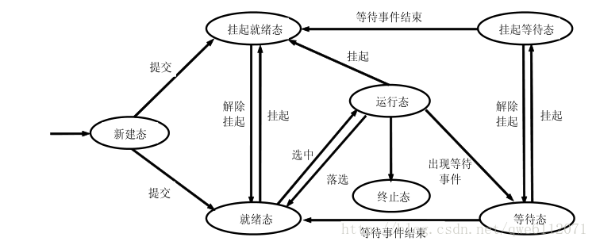

## 进程实体
```
由程序段、数据段、程序控制块(PCB)构成, 其中程序段可以认为是程序经编译后的二进制代码文件, 数据段可以
认为是该程序或进程执行时拥有的数据, 而程序控制块PCB则保存了该进程的一些信息(如下)
```

## 程序控制块PCB
```
作用: 记录了操作系统所需的, 用于描述进程的当前情况以及管理进程运行的全部信息, 是进程存在于操作系统
      中的唯一标志

组成:
  <1> 进程标识符, 一个进程的唯一标识, 分为外部标识符(如windows任务管理器中QQ, 谷歌等程序的名字,
      是给用户看的), 以及内部标识符(PID, 进程的唯一ID, 是给操作系统看的)
  <2> 处理机状态, 也称处理机的上下文, 表示进程当前的执行栈情况和指令情况, 以及一些寄存器的内容
  <3> 进程调度, 保存了该进程在进程调度时的信息以及该进程的状态(七个状态, 后面会补充), 如进程的优先
      级, 进程的状态, 进程调度所需的其它信息, 进程状态改变的事件(如从执行状态变为阻塞状态的事件)
  <4> 进程控制信息, 如程序和数据的地址(在重新调度该进程时需要根据这些信息获取原来拥有的数据), 进程
      同步和通信机制(如消息队列, 信号量), 资源清单(进程运行时需要的除CPU之外的所有资源)等

PCB的组织方式:
  <1> 线性方式, 对于操作系统的运行的所有程序的PCB来说, 将它们放置在一张线性表中, 优点是简单, 缺点
      是需要扫描整张线性表才能找到对应的PCB, 对于程序较多的OS来说无疑是效率不高的
  <2> 链接方式, 把具有相同状态的进程的PCB链接成一条队列, 如就绪队列, 阻塞队列, 从而可以根据状态的
      不同来尽快的找到不同的PCB
  <3> 索引方式, 根据不同的状态建立不同的索引方式, 然后将对应的PCB的指针放入该表中       
```

## 进程定义
```
程序的一次执行, 是系统资源分配和处理机调度的基本单位, 通常情况下, 我们所说的进程就是进程实体, 而创
建进程和撤销进程其实就是创建进程的PCB和撤销进程的PCB
```

## 进程的特征
```
<1> 动态性, 进程是进程实体在操作系统的执行过程, 是动态的, 而程序是一系列指令的集合, 是静态的
<2> 并发行, 多个进程可以并发的执行
<3> 独立性, 指的是进程是一个可以独立运行, 独立获得资源, 独立接受调度的基本单位
<4> 异步性, 进程是以未知的速度向前推进的, 也可以理解为并发的存在导致了进程走走停停, 即为异步性
```

## 进程的七状态模型
```
在OS书中, 描述进程时依次引入了3状态模型, 5状态模型, 7状态模型, 在这里我们直接引入七状态模型

创建状态: 进程在创建过程中, 因某一个资源未达到要求分配, 从而等待资源的分配, 如内存
就绪状态: 进程PCB创建完成后, 获取了除CPU之外的所有资源, 即没有CPU资源时就是处于就绪状态, 一旦拥有
          CPU就会立马执行, 在七状态模型中, 将该状态又细分为了静止就绪和活动就绪
    静止就绪: 当系统资源紧张, 在经过OS的判断下, 该进程创建后先不分配给其一些资源(如内存), 可以理解
              为Linux中交换区, 当系统资源紧张时, 进程会被唤出内存, 保存在外存的交换区
    活动就绪: 即进程获取了除CPU外的所有资源, 一旦分配CPU即可执行
执行状态: 进程获取了CPU后执行的状态
阻塞状态: 因某个事件, 进程自我阻塞, 并主动放弃CPU资源, 如进程需要打印机的时候, 发现打印机正在被使用,
        此时其会自我阻塞, 等待打印机可用时再被中断处理程序唤起, 在七状态模型中, 阻塞状态也被细分为
        两种状态
    静止阻塞: 当处于阻塞状态的进程因OS资源紧张而被唤出内存到外存, 如一个处于活动阻塞的进程被唤出到
              交换区中
    活动阻塞: 即因为某种事件(如共享资源打印机访问失败)进程自我阻塞, 放弃CPU资源
终止状态: 进程执行完毕或者因异常而关闭则进入终止状态, 在该状态下会归还系统资源并删除PCB

如下图(网上搜索得到)所示, 挂起就绪态和挂起态分别对应静止就绪和活动就绪, 挂起等待态和等待态分别对应
静止阻塞和活动阻塞
```



## 状态具体描述
- 创建状态
  ```
  创建过程:
    <1> 申请空白的PCB
    <2> 为新进程分配器所需的资源, 如内存、设备等
    <3> 初始化进程控制块PCB的信息, 如初始化进程标识符等
    <4> 如果就绪队列中能够容纳该进程, 则将该进程放入就绪队列等待CPU的调度
  ```
- 终止状态
  ```
  引起终止的事件:
    <1> 正常执行结束
    <2> 异常结束(如数组越界)
    <3> 外界干预

  终止过程:
    <1> 根据进程标识符找到该进程, 如果该进程还有子孙进程则先终止其子孙进程
    <2> 将进程所拥有的资源归还给其父进程或者OS
    <3> 将PCB从所在的队列中移除   
  ```  
- 进程的阻塞和唤醒
  ```
  引起进程阻塞的事件:
    <1> 请求共享资源失败, 如打印机, 或者请求进入临界区失败(锁已被其它进程拥有)
    <2> 等待某种操作完成, 如计算进程必须等输入进程输入了数据才能执行
    <3> 新数据尚未到达
    <4> 等待新任务到达

  进程阻塞的过程:
    阻塞是进程自身的一种行为, 将进程的PCB中的状态修改为阻塞状态并将进程插入对应的阻塞队列 

  进程唤醒的过程:
    当阻塞进程期望的事件发生时(如其它进程占用的锁已经归还), 此时将进程从阻塞队列中移除, 并将其切换
    为就绪状态以及插入就绪队列, 等待CPU的调用  
  ```
- 进程的挂起与激活
  ```
  挂起: 如果进程处于活动阻塞状态, 则将其转换为静止阻塞, 并将进程唤出到外存, 如果处于活动就绪, 则将
        其转换为静止就绪, 并将其唤出到外存
  激活: 将进程从外存唤进内存, 静止就绪 => 活动就绪, 静止阻塞 => 活动阻塞
  ```


